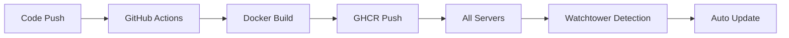

# 🚀 NAS Automated Deployment Pipeline

Complete automated build/deployment pipeline design for open-source NAS system

## 🎯 Goals
- **One-Click Deployment**: Complete setup with `docker-compose up`
- **Auto-Updates**: Automatic deployment to all servers on new releases  
- **Minimal Configuration**: Operational with just a few `.env` modifications
- **Open Source Friendly**: Free tier usage with GitHub Actions + GitHub Container Registry

## 🔄 Pipeline Architecture



### Stage 1: Automated Build 🏗️
```yaml
# .github/workflows/build.yml
name: Build & Push Docker Image

on:
  push:
    branches: [main]
    tags: ['v*']

jobs:
  build:
    runs-on: ubuntu-latest
    steps:
      - uses: actions/checkout@v4
      
      - name: Login to GitHub Container Registry
        uses: docker/login-action@v3
        with:
          registry: ghcr.io
          username: ${{ github.actor }}
          password: ${{ secrets.GITHUB_TOKEN }}
      
      - name: Build and push
        uses: docker/build-push-action@v5
        with:
          context: .
          push: true
          tags: |
            ghcr.io/${{ github.repository }}:latest
            ghcr.io/${{ github.repository }}:${{ github.sha }}
```

### Stage 2: Automated Deployment 🚀
```yaml
# docker-compose.yml (single deployment file)
version: '3.8'

services:
  nas:
    image: ghcr.io/${GITHUB_REPOSITORY:-your-username/nas}:latest
    container_name: nas-app
    restart: unless-stopped
    ports:
      - "${PORT:-7777}:7777"
    volumes:
      - ${DATA_PATH:-./data}:/app/data
      - ${CONFIG_PATH:-./config}:/app/config
    env_file:
      - .env
    labels:
      - "com.centurylinklabs.watchtower.enable=true"

  # Auto-update agent
  watchtower:
    image: containrrr/watchtower:latest
    container_name: nas-watchtower
    restart: unless-stopped
    volumes:
      - /var/run/docker.sock:/var/run/docker.sock
    environment:
      - WATCHTOWER_CLEANUP=true
      - WATCHTOWER_POLL_INTERVAL=300  # Check every 5 minutes
      - WATCHTOWER_INCLUDE_RESTARTING=true
    command: nas-app  # Monitor nas-app container only
```

## 📁 Final Project Structure

```
NAS/
├── Dockerfile                 # Single Docker build file
├── docker-compose.yml        # Single deployment file
├── .env.example              # Configuration template
├── scripts/
│   ├── build.sh             # Local build script
│   └── setup.sh             # Installation/upgrade script
├── .github/workflows/
│   └── build-and-deploy.yml # Automated build
├── docs/
│   └── DEPLOYMENT_PIPELINE.md # This guide
└── README.md                 # Installation guide
```

## 🛠️ User Installation Guide

### 1. Fork Repository
```bash
# Fork this repository on GitHub to your account
# https://github.com/original-author/nas → Click Fork button
```

### 2. Clone Forked Repository
```bash
git clone https://github.com/YOUR-USERNAME/nas.git
cd nas
```

### 3. Environment Setup
```bash
# Create .env file
cp .env.example .env

# Edit required settings
vim .env
```

**Required modifications:**
```bash
# Change to your GitHub repository (important!)
GITHUB_REPOSITORY=YOUR-USERNAME/nas

# Change secret key (security essential!)
JWT_SECRET=your-random-64-character-string

# Change admin password
ADMIN_PASSWORD=your-secure-password

# Data storage path
DATA_PATH=./data
```

### 4. One-Click Installation
```bash
# Run automated setup script
chmod +x scripts/setup.sh
./scripts/setup.sh

# Or run directly
docker-compose up -d
```

### 5. Auto-Update Activation
Watchtower is already included in docker-compose.yml - **no additional setup required**!
- Checks for new images every 5 minutes
- Automatically redeploys when found
- Zero-downtime updates

## ⚙️ Environment Variables (.env)

```bash
# === Required Settings ===
JWT_SECRET=please-change-this-secret-key
ADMIN_PASSWORD=your-admin-password
GITHUB_REPOSITORY=your-username/nas

# === Optional Settings ===
PORT=7777
DATA_PATH=/mnt/nas-storage
CONFIG_PATH=./config
NODE_ENV=production

# === Auto-Update Settings ===
WATCHTOWER_POLL_INTERVAL=300    # Check interval (seconds)
WATCHTOWER_CLEANUP=true         # Auto-cleanup old images
```

## 🔄 Update Process

### Developer (Maintainer)
1. Modify code and push to GitHub
2. GitHub Actions automatically builds
3. New image uploaded to ghcr.io
4. **Done!** ✅

### User (Server Operator)  
1. **Do nothing** 😎
2. Watchtower automatically updates
3. Check logs with `docker-compose logs -f` if needed

### Manual Update
```bash
# For immediate update
docker-compose pull
docker-compose up -d

# Or use upgrade script
./scripts/setup.sh --upgrade
```

## 🎯 Key Benefits

### User Perspective
- **Easy Installation**: git clone → configure → docker-compose up
- **Auto-Updates**: Set once, always stay up-to-date
- **Zero-Downtime**: Service continues during updates
- **Minimal Configuration**: Just edit a few lines in .env

### Developer Perspective  
- **Deployment Automation**: Just push code, deploys everywhere
- **Zero Infrastructure Cost**: Use GitHub free features only
- **Minimal User Support**: "Run docker-compose up" and done
- **Version Management**: Automatic tag-based image management

## 🚨 Security Considerations

### Image Security
- Regular base image updates
- Automated vulnerability scanning (GitHub Security)
- Run with minimal privileges (non-root user)

### Environment Variable Security
- .env files excluded from Git
- Default values for development, must change for production
- JWT secret auto-generation feature provided

## 📊 Monitoring

```yaml
# Monitoring options to add to docker-compose.yml
services:
  nas:
    # ... existing configuration
    healthcheck:
      test: ["CMD", "curl", "-f", "http://localhost:7777/health"]
      interval: 30s
      timeout: 10s
      retries: 3
    logging:
      driver: "json-file"
      options:
        max-size: "10m"
        max-file: "3"
```

## 💰 Cost Management (Fork Strategy)

### Why Fork is Required
- **Individual Images**: Each user uses their own GitHub Container Registry
- **Cost Prevention**: Prevents bandwidth costs on original repository
- **Free Customization**: Users can modify according to their needs
- **Independent Updates**: Users control their own update schedule

### Cost Structure
- **Original Author**: $0 (no one uses your images)
- **Users**: Each uses their own GHCR (within free limits)

## 🎉 Conclusion

This pipeline creates a **completely automated NAS deployment system**!

- **Developer**: Just write code
- **User**: Install and forget  
- **Server**: Automatically stays up-to-date

**The dream deployment system for open-source projects** 🚀

## 🔧 Advanced Configuration

### Change Update Frequency
```bash
# .env file (in seconds)
WATCHTOWER_POLL_INTERVAL=1800  # Every 30 minutes
```

### Disable Auto-Updates
```bash
# Comment out watchtower service in docker-compose.yml
# watchtower:
#   image: containrrr/watchtower:latest
#   ...
```

### Custom Build Arguments
```bash
# For local development builds
./scripts/build.sh --local
```

## 🐛 Troubleshooting

### Image Not Found
```bash
# Check GITHUB_REPOSITORY in .env
GITHUB_REPOSITORY=YOUR-USERNAME/nas  # Correct repository name

# Verify GitHub Container Registry is public
# GitHub → Your Repository → Packages → nas → Package settings → Change visibility
```

### Auto-Updates Not Working
```bash
# Check Watchtower logs
docker-compose logs watchtower

# Test manual update
docker-compose pull
```

### Port Conflicts
```bash
# Use different port in .env
PORT=8080

# Restart
docker-compose down && docker-compose up -d
```

---

**Happy NAS deployment! 🎉**