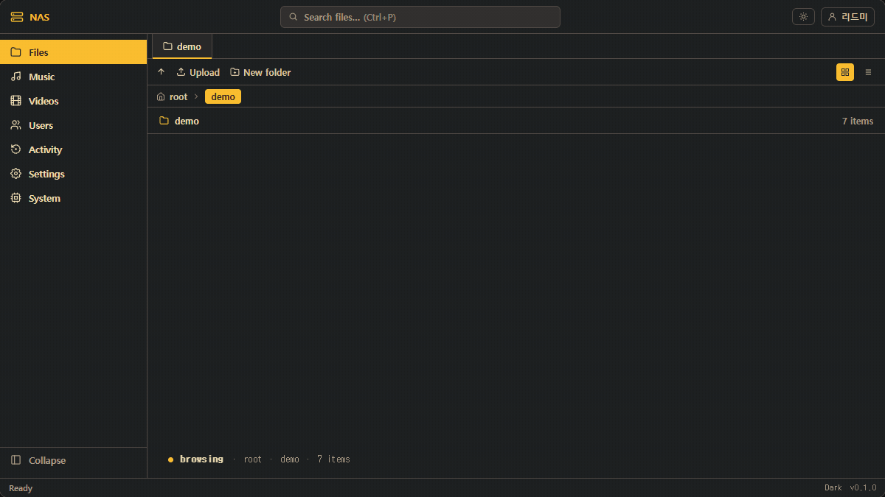
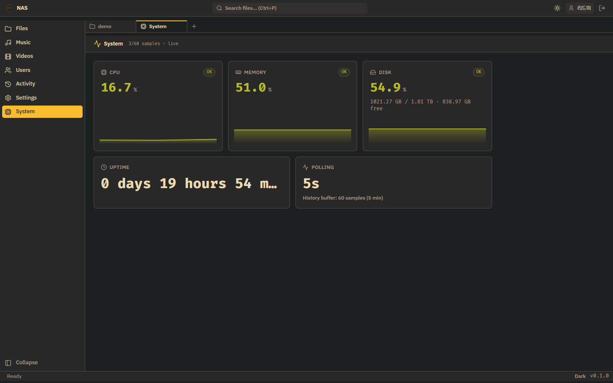
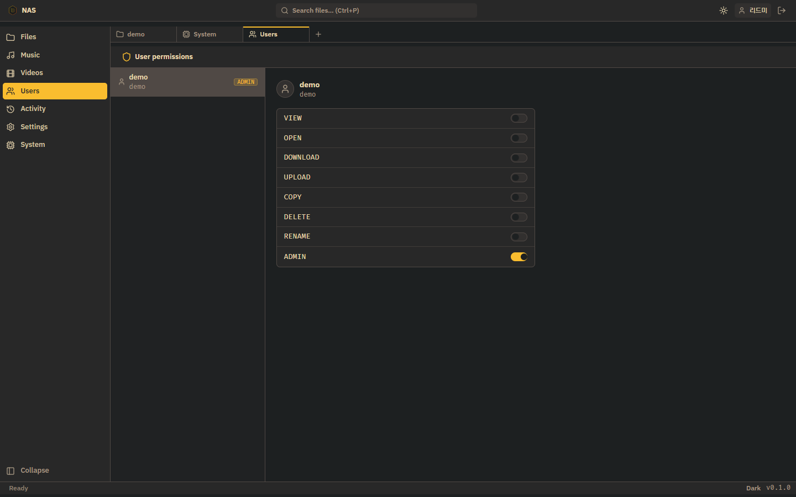
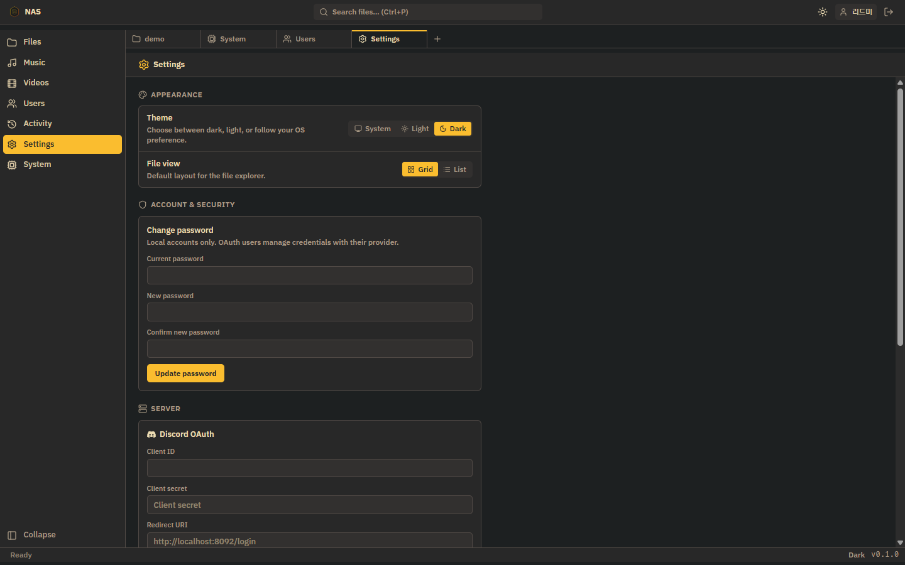
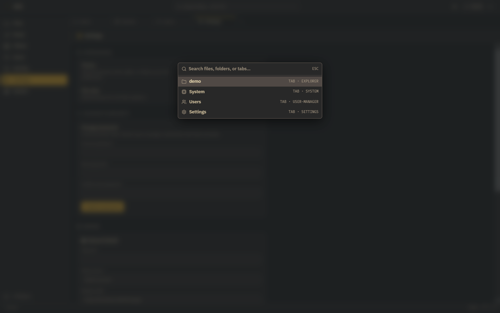

<p align="center">
  
</p>

<h1 align="center">NAS</h1>

<p align="center">
  <b>브라우저 하나로 끝나는 셀프호스트 파일 서버.</b><br/>
  Go 백엔드 · SvelteKit 프론트엔드 · Docker 이미지 한 개로 배포.
</p>

<p align="center">
  
  
  
  
  
</p>

<p align="center">
  <a href="README_EN.md">English</a> · <a href="#한-줄-요약">한 줄 요약</a> · <a href="#빠른-시작">빠른 시작</a> · <a href="#기능">기능</a> · <a href="#스크린샷">스크린샷</a> · <a href="#아키텍처">아키텍처</a>
</p>

---

## 한 줄 요약

> 내 데이터는 내 서버에. 브라우저만 있으면 어디서나, 단 하나의 Docker 이미지로.

NAS 는 자체 호스팅 파일 서버다. 로컬 디스크에 있는 파일을 그대로 브라우저에서 탐색·재생·편집하고, 8개 인텐트(VIEW · OPEN · DOWNLOAD · UPLOAD · COPY · DELETE · RENAME · ADMIN)로 사용자별 권한을 토글한다. Go 단일 바이너리와 SvelteKit static 빌드를 Alpine 이미지 하나에 묶어 배포한다 — CGO 없이.

---

## 빠른 시작

### Docker 로 실행 (권장)

```bash
git clone https://github.com/<owner>/nas.git
cd nas
cp .env.example .env
# .env 에서 PRIVATE_KEY, ADMIN_PASSWORD 두 줄만 수정해도 동작
docker compose up -d
```

`http://localhost:7777` 에서 회원가입한 뒤, 헤더 우측 계정 아이콘 → **Request admin** 으로 관리자 권한을 신청한다. `ADMIN_PASSWORD` 와 일치하는 값을 입력하면 즉시 부여된다.

### 로컬 개발

```bash
# 백엔드 (포트 7777)
cd backend && go run ./cmd/server

# 프론트엔드 (다른 터미널, Vite 가 백엔드로 /server/* 프록시)
cd frontend && npm install && npm run dev
```

---

## 기능

| 영역 | 내용 |
|------|------|
| **파일 관리** | 폴더 탐색, 업/다운로드, 복사·이동·이름변경·삭제, ZIP 압축/해제 |
| **재개 가능한 업로드** | [tus 프로토콜](https://tus.io) (`tusd/v2`) · 단일 파일 상한 `MAX_FILE_SIZE` (기본 50 GB) |
| **인라인 에디터** | Monaco 에디터 + Gruvbox 테마. 텍스트·코드·설정 파일 그 자리에서 편집 |
| **미디어 뷰어** | 영상·음악·이미지·PDF·Office 문서, 별도 다운로드 없이 재생/미리보기 |
| **인증** | 로컬(bcrypt) · Discord OAuth · Google OAuth · 백엔드가 단일 출처 |
| **권한 모델** | 8 인텐트(`VIEW` / `OPEN` / `DOWNLOAD` / `UPLOAD` / `COPY` / `DELETE` / `RENAME` / `ADMIN`)를 사용자별 토글 |
| **시스템 대시보드** | `gopsutil` 기반 CPU/메모리/디스크/업타임 실시간 (5초 폴, 60샘플 = 5분 슬라이딩 윈도우) |
| **운영 도구** | Quick Open(Ctrl+P) · Activity 로그 · 관리자 OAuth 자격증명 UI · 라이브 액티비티 |
| **테마** | Gruvbox dark/light, `prefers-color-scheme` 추종 + 수동 토글 |

---

## 스크린샷

### 파일 탐색기 — VSCode 패턴, 좌측 네비 / 상단 탭 / 하단 상태바


루트 그리드 뷰. 좌측 사이드바는 Files · Music · Videos · Users · Activity · Settings · System 7개 화면 (관리자는 전체, 비관리자는 앞 4개만). VSCode 스타일 탭으로 여러 화면을 동시에 띄울 수 있다.

### 시스템 대시보드 — gopsutil, 5초 폴, 60샘플 슬라이딩 윈도우



`OK` / `WARN` 뱃지로 임계 시각화. 5초마다 폴링하여 최근 5분 = 60샘플을 막대로 누적해 보여준다. 하단 카드는 업타임과 폴링 주기.

### 사용자 권한 — 사용자별 8 인텐트 토글



ADMIN 인텐트는 관리자 화면 접근권한 그 자체. 한 명의 ADMIN 도 없는 상태는 자동으로 발생하지 않는다 (가장 먼저 `Request admin` 으로 신청한 사용자가 시드 관리자가 된다).

### 설정 — Appearance · Account · Server OAuth



테마와 기본 파일 뷰는 사용자별 저장. Discord/Google OAuth 자격증명은 런타임 DB 에 저장되므로 프론트엔드 빌드시 환경 변수에 의존하지 않는다.

### Quick Open (Ctrl+P) — 파일·폴더·탭 통합 검색



VSCode 의 Quick Open 과 같은 모드. 열린 탭, 등록된 화면(System · Users · Settings · Activity), 그리고 현재 폴더의 파일까지 한 번에 검색한다.

### 로그인


`AUTH_TYPE` 설정에 따라 로컬 / OAuth / 둘 다 노출. OAuth 제공자는 관리자 화면에서 자격증명을 등록한 뒤 활성화된다.

---

## 기술 스택

| 영역 | 사용 기술 |
|------|----------|
| 백엔드 | Go 1.25 · [chi v5](https://github.com/go-chi/chi) · [modernc/sqlite](https://gitlab.com/cznic/sqlite) (순수 Go) · [tusd v2](https://github.com/tus/tusd) · [gopsutil v3](https://github.com/shirou/gopsutil) · [golang-jwt v5](https://github.com/golang-jwt/jwt) |
| 프론트엔드 | SvelteKit (adapter-static) · Svelte 5 runes · Tailwind 4 · [Monaco editor](https://github.com/microsoft/monaco-editor) · Vite 6 |
| 디자인 | Gruvbox dark/light · `mode-watcher` · `lucide-svelte` 아이콘 · IBM Plex Sans (550 weight) · FiraD2 mono |
| 배포 | 멀티스테이지 Alpine Docker · GHCR · Watchtower 옵셔널 자동 업데이트 |
| 저장소 | SQLite 단일 파일, 시작 시 스키마 자동 생성/검증 |

CGO 없이 빌드 → 크로스 컴파일 단순. SvelteKit static 빌드는 백엔드 바이너리가 그대로 서빙한다.

---

## 아키텍처

```
┌───────────────────────────────────────────────────────────────┐
│                     Browser (SPA)                              │
│  SvelteKit static · Tailwind · Monaco · Svelte 5 runes         │
└───────────────────────────────────────────────────────────────┘
                          │  HTTP/JSON, tus, ranged GET
                          ▼
┌───────────────────────────────────────────────────────────────┐
│                Go server (single binary, no CGO)               │
│  chi router · JWT middleware · intent middleware               │
│  ├─ /auth/*               local & OAuth                        │
│  ├─ /files, /readFolder…  파일 조작                              │
│  ├─ /files/*              tus 재개 업로드                        │
│  ├─ /getVideoData,        ranged 스트리밍                        │
│  │  /getAudioData,                                             │
│  │  /download                                                  │
│  ├─ /admin/oauth-config,  관리자                                 │
│  │  /authorize                                                 │
│  ├─ /getSystemInfo        gopsutil 메트릭                       │
│  └─ /                     SPA(adapter-static) 정적 서빙          │
└───────────────────────────────────────────────────────────────┘
        │                                       │
        ▼                                       ▼
┌────────────────────┐                ┌────────────────────────┐
│  SQLite (modernc)  │                │  filesystem            │
│  users, intents,   │                │  /data/nas             │
│  activity_log,     │                │  /data/nas-admin       │
│  oauth_config      │                │  /tmp/nas (tus stage)  │
└────────────────────┘                └────────────────────────┘
```

라우터 전체 정의는 [`backend/internal/server/router.go`](backend/internal/server/router.go) 한 파일에 모여 있다. 사이드바 7개 화면은 [`frontend/src/lib/components/Shell/nav-items.ts`](frontend/src/lib/components/Shell/nav-items.ts) 에서 정의한다.

---

## 환경 변수

| 변수 | 기본값 | 설명 |
|------|--------|------|
| `PORT` | `7777` | HTTP 리스닝 포트 |
| `DATA_PATH` | `./data` | 호스트 측 데이터 루트 (Docker 마운트 기준) |
| `PRIVATE_KEY` / `JWT_SECRET` | (필수) | JWT 서명 키. 32바이트 이상 권장 |
| `ADMIN_PASSWORD` | (필수) | `Request admin` 호출 시 검증되는 비밀번호 |
| `AUTH_TYPE` | `both` | `local`, `oauth`, `both` 중 선택 |
| `CORS_ORIGIN` | `*` | CORS 허용 오리진 |
| `MAX_FILE_SIZE` | `50gb` | 단일 업로드 상한 |
| `DISCORD_CLIENT_ID/SECRET/REDIRECT_URI` | — | OAuth 부트스트랩. 이후 관리자 UI 로 덮어쓰기 가능 |
| `GOOGLE_CLIENT_ID/SECRET/REDIRECT_URI` | — | 동일 |
| `TZ` | `UTC` | 컨테이너 타임존 |

전체 목록: [`.env.example`](.env.example).

---

## 개발

```bash
# 백엔드 테스트 (integration 포함)
cd backend && go test ./...

# 프론트엔드 타입 체크
cd frontend && npm run check

# 전체 프로덕션 빌드
cd backend && go build -o bin/server ./cmd/server
cd frontend && npm run build
```

세부 문서는 [`Docs/`](Docs/README.md) 참고.

---

## 자동 업데이트 (옵션)

Watchtower 가 5분마다 GHCR 이미지 변경을 감지해 무중단 롤링 재시작한다. 기본 비활성, 명시적으로 켠다.

```bash
docker compose --profile autoupdate up -d
```

GitHub Actions(`.github/workflows/build-and-deploy.yml`)가 main 브랜치 push 마다 이미지를 빌드해 `ghcr.io/<owner>/nas:latest` 로 푸시한다. 본인 계정에서 쓰려면 저장소를 fork 한 뒤 `GITHUB_REPOSITORY` 와 GHCR 패키지 가시성을 본인 것으로 맞춰주면 된다.

---

## 라이선스

[MIT](LICENSE).
