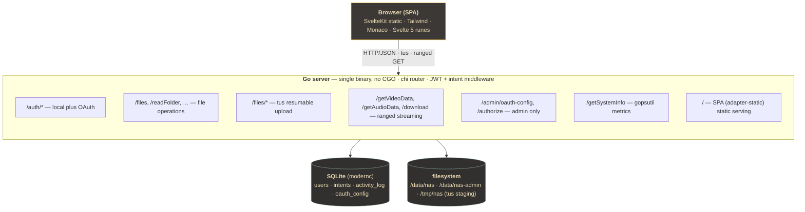

<p align="center">
  
</p>

<h1 align="center">NAS</h1>

<p align="center">
  <b>A self-hosted file server you reach from the browser.</b><br/>
  Go backend · SvelteKit frontend · one Docker image to ship it all.
</p>

<p align="center">
  
  
  
  
  
</p>

<p align="center">
  <a href="README.md">한국어</a> · <a href="#one-line">One line</a> · <a href="#quick-start">Quick start</a> · <a href="#features">Features</a> · <a href="#screenshots">Screenshots</a> · <a href="#architecture">Architecture</a>
</p>

---

## One line

> Your data on your server, from any browser, in one Docker image.

NAS is a self-hosted file server. Files on your disk are browsed, streamed and edited straight from the browser, with eight per-user intents (VIEW · OPEN · DOWNLOAD · UPLOAD · COPY · DELETE · RENAME · ADMIN) gating every operation. The Go binary and the static SvelteKit build ship together in a single Alpine image — no CGO required.

---

## Quick start

### Run with Docker

```bash
git clone https://github.com/<owner>/nas.git
cd nas
cp .env.example .env
# Edit PRIVATE_KEY and ADMIN_PASSWORD; the rest has sensible defaults.
docker compose up -d
```

Open `http://localhost:7777`, register, then claim admin from the account menu (top-right) → **Request admin**. The request is gated by `ADMIN_PASSWORD`, so any user that knows it is promoted on the spot. The same panel is offered inline from the friendly 403 view when a non-admin lands on an admin-only screen.

### Local development

```bash
# Backend (port 7777)
cd backend && go run ./cmd/server

# Frontend (separate terminal; Vite proxies /server/* to the backend)
cd frontend && npm install && npm run dev
```

---

## Features

| Area | What |
|------|------|
| **File operations** | Browse, upload, download, copy, move, rename, delete, zip/unzip |
| **Resumable uploads** | [tus protocol](https://tus.io) via `tusd/v2` · per-file cap `MAX_FILE_SIZE` (50 GB default) |
| **In-browser editor** | Monaco with a Gruvbox theme for inline editing of text and code |
| **Media viewers** | Video, audio, image, PDF, Office documents — no download round-trip |
| **Authentication** | Local accounts (bcrypt) · Discord OAuth · Google OAuth · backend is the single source of truth |
| **Permission model** | Eight per-user intents (`VIEW` / `OPEN` / `DOWNLOAD` / `UPLOAD` / `COPY` / `DELETE` / `RENAME` / `ADMIN`) |
| **System dashboard** | `gopsutil`-backed live metrics — CPU, memory, disk, uptime, 5 s poll, 60-sample (5 min) sliding window |
| **Ops surface** | Quick Open (`Ctrl+P`) · Activity log · admin UI for OAuth credentials |
| **Theme** | Gruvbox dark/light, follows `prefers-color-scheme` with manual toggle |

---

## Screenshots

### File explorer — VSCode pattern: sidebar nav, top tabs, bottom status bar


The sidebar exposes seven surfaces (Files · Music · Videos · Users · Activity · Settings · System) — admins see all, non-admins see the first four. Tabs let you keep several workflows open at once, VSCode-style.

### System dashboard — gopsutil, 5 s poll, 60-sample sliding window


`OK` / `WARN` badges flag thresholds. Five-second polling builds a five-minute (60-sample) bar history under each card. The lower row tracks uptime and the current polling interval.

### User permissions — eight intents per user


The `ADMIN` intent is itself the gate to the admin screens. The server never ends up zero-admin: whoever knows the `ADMIN_PASSWORD` and asks first becomes the seed admin.

### Settings — Appearance, Account, Server OAuth


Theme and default file view are per-user. Discord/Google OAuth credentials are stored at runtime in the DB, so the frontend build does not depend on env-time secrets.

### Quick Open (Ctrl+P) — unified files / folders / tabs search


Same idea as VSCode's Quick Open. It searches open tabs, registered surfaces (System · Users · Settings · Activity), and files in the current folder, all from one input.

### Sign-in


`AUTH_TYPE` controls which paths appear — local-only, OAuth-only, or both. OAuth providers light up once an admin has registered credentials in Settings.

---

## Stack

| Area | Technology |
|------|-----------|
| Backend | Go 1.25 · [chi v5](https://github.com/go-chi/chi) · [modernc/sqlite](https://gitlab.com/cznic/sqlite) (pure Go) · [tusd v2](https://github.com/tus/tusd) · [gopsutil v3](https://github.com/shirou/gopsutil) · [golang-jwt v5](https://github.com/golang-jwt/jwt) |
| Frontend | SvelteKit (adapter-static) · Svelte 5 runes · Tailwind 4 · [Monaco editor](https://github.com/microsoft/monaco-editor) · Vite 6 |
| Design | Gruvbox dark/light · `mode-watcher` · `lucide-svelte` icons · IBM Plex Sans (550 weight) · FiraD2 mono |
| Deployment | Multi-stage Alpine Docker · GHCR · optional Watchtower auto-update |
| Storage | Single-file SQLite, schema auto-created and verified on startup |

No CGO means cross-compilation stays simple. The SvelteKit static build is embedded and served by the same Go binary.

---

## Architecture



The whole router lives in [`backend/internal/server/router.go`](backend/internal/server/router.go) — one file. The seven sidebar surfaces are defined in [`frontend/src/lib/components/Shell/nav-items.ts`](frontend/src/lib/components/Shell/nav-items.ts).

---

## Environment variables

| Variable | Default | Description |
|----------|---------|-------------|
| `PORT` | `7777` | HTTP listen port |
| `DATA_PATH` | `./data` | Host data root (relative to the Docker mount) |
| `PRIVATE_KEY` / `JWT_SECRET` | (required) | JWT signing key. 32 bytes recommended |
| `ADMIN_PASSWORD` | (required) | Verified when `Request admin` is called |
| `AUTH_TYPE` | `both` | One of `local`, `oauth`, `both` |
| `CORS_ORIGIN` | `*` | Allowed CORS origin |
| `MAX_FILE_SIZE` | `50gb` | Per-file upload cap |
| `DISCORD_CLIENT_ID/SECRET/REDIRECT_URI` | — | OAuth bootstrap; can be overridden via the admin UI |
| `GOOGLE_CLIENT_ID/SECRET/REDIRECT_URI` | — | Same |
| `TZ` | `UTC` | Container timezone |

Full list: [`.env.example`](.env.example).

---

## Development

```bash
# Backend tests (integration included)
cd backend && go test ./...

# Frontend type check
cd frontend && npm run check

# Full production build
cd backend && go build -o bin/server ./cmd/server
cd frontend && npm run build
```

More docs: [`Docs/`](Docs/README.md).

---

## Auto-update (optional)

Watchtower checks GHCR every 5 minutes and performs a zero-downtime rolling restart on new images. Off by default, opt in explicitly:

```bash
docker compose --profile autoupdate up -d
```

The GitHub Actions workflow (`.github/workflows/build-and-deploy.yml`) builds an image on every push to `main` and pushes it to `ghcr.io/<owner>/nas:latest`. To run it under your own account, fork the repo and adjust `GITHUB_REPOSITORY` plus the GHCR package visibility accordingly.

---

## License

[MIT](LICENSE).
