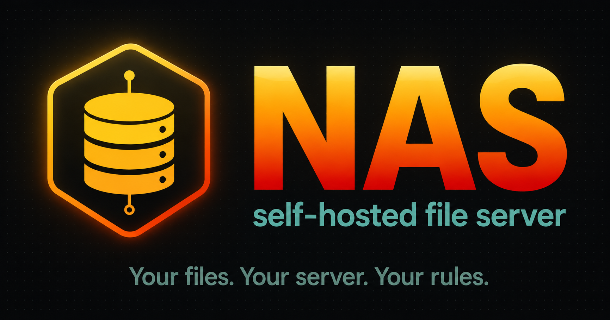
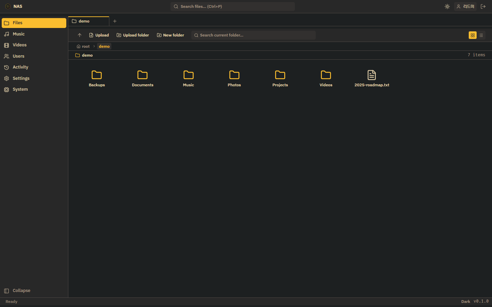
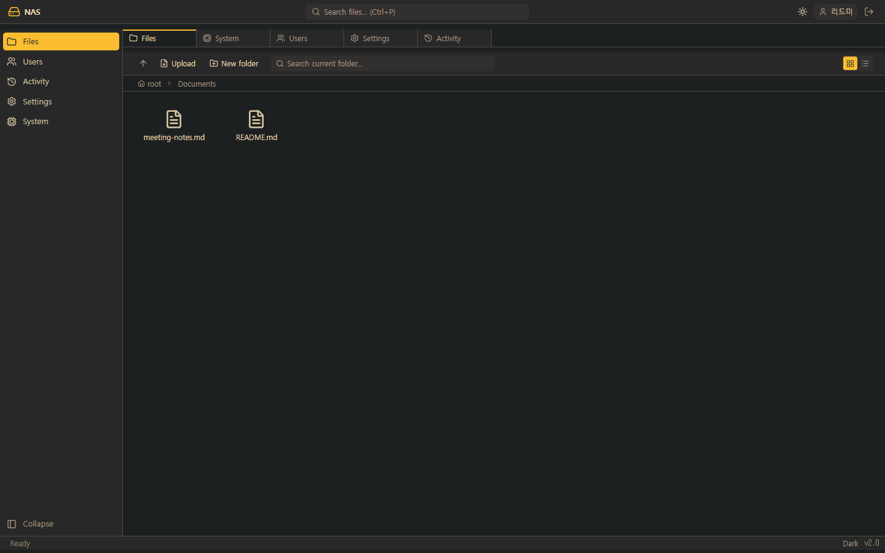
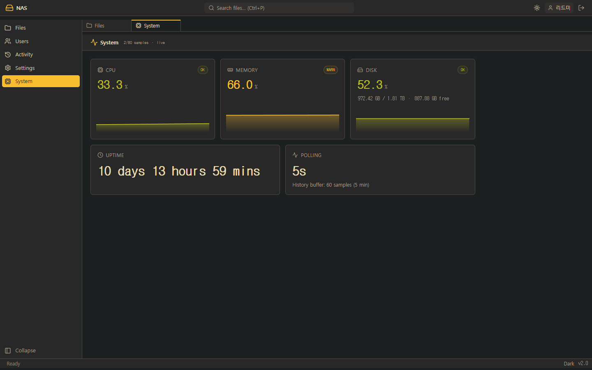
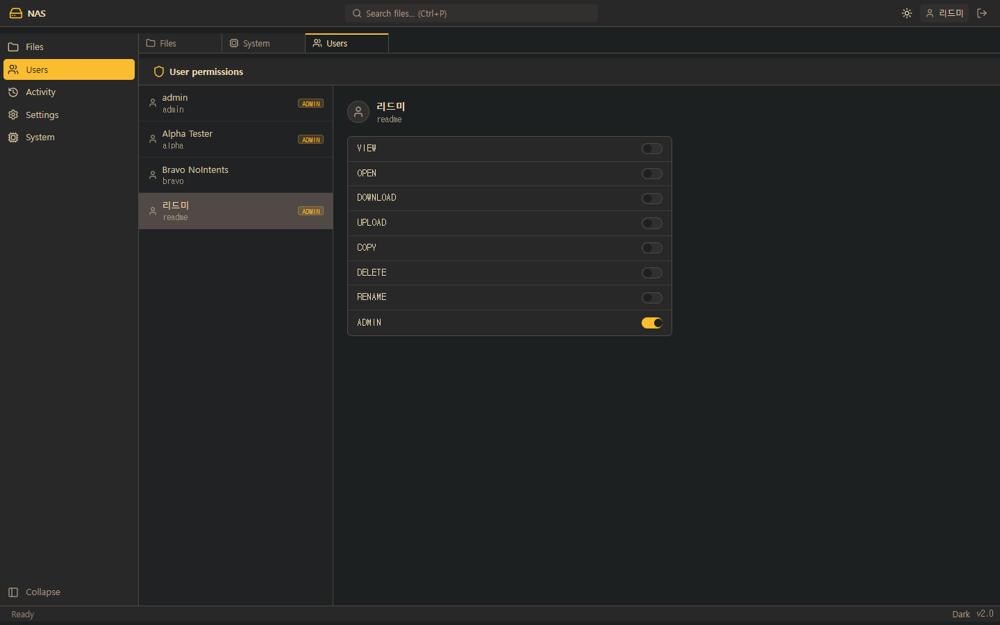
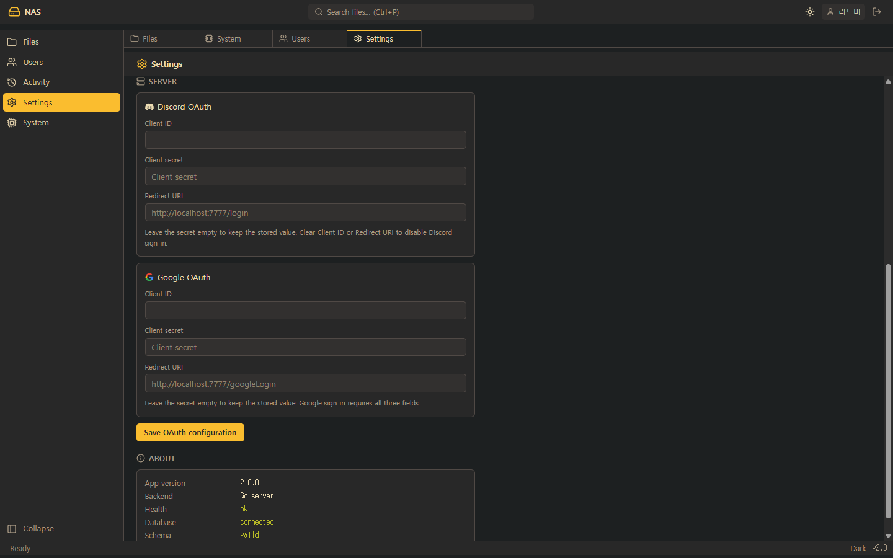
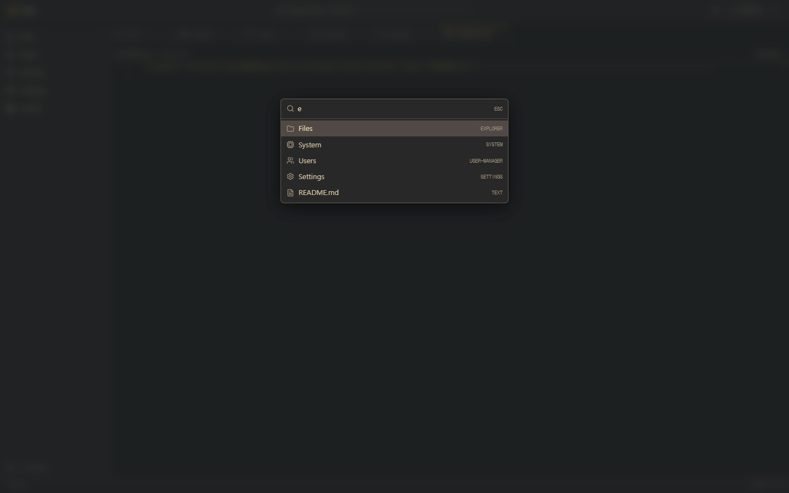
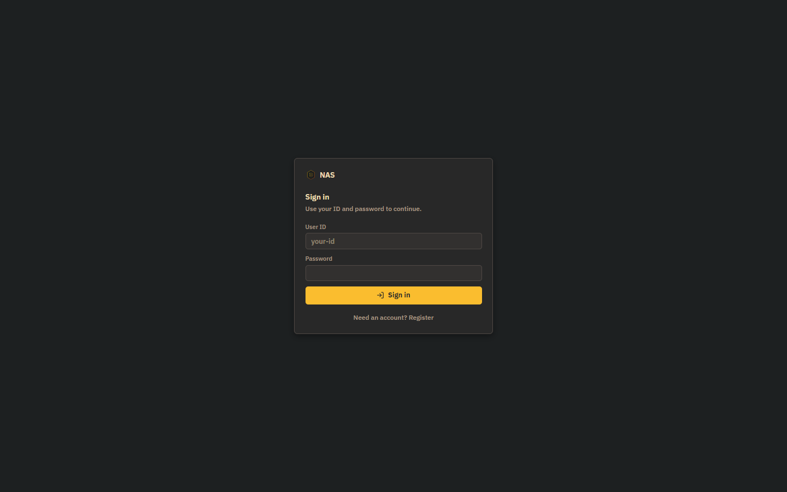

<p align="center">
  
</p>

A self-hosted, browser-based file server. Go backend, SvelteKit frontend, shipped as a single Docker image.

> 한국어: [README.md](README.md)

## What it does

- **File operations** — browse, upload, download, copy, move, rename, delete, zip/unzip
- **Resumable uploads** — [tus protocol](https://tus.io) via `tusd/v2`; per-file cap is `MAX_FILE_SIZE` (50 GB by default)
- **In-browser editor** — Monaco with a Gruvbox theme for inline editing of text and code files
- **Authentication** — local accounts (bcrypt) plus Discord and Google OAuth, backend is the single source of truth
- **Permission model** — eight per-user intents (VIEW, OPEN, DOWNLOAD, UPLOAD, COPY, DELETE, RENAME, ADMIN) toggled by admins
- **Ops surface** — system metrics dashboard (CPU/memory/disk/uptime), activity log, admin UI for OAuth credentials

## Stack

| Area | Technology |
|------|-----------|
| Backend | Go 1.25 · chi v5 · modernc/sqlite (pure Go) · tusd v2 · gopsutil v3 · golang-jwt v5 |
| Frontend | SvelteKit (adapter-static) · Svelte 5 runes · Tailwind 4 · Monaco editor · Vite 6 |
| Design | Gruvbox dark/light · `mode-watcher` · `lucide-svelte` icons |
| Deployment | Multi-stage Alpine Docker, optional Watchtower auto-update |
| Storage | Single-file SQLite, schema auto-created and verified on startup |

Ships as one binary plus a built SPA inside an Alpine image. The pure-Go SQLite driver removes the need for CGO and keeps cross-compilation trivial.

## Quick start

### Run with Docker

```bash
git clone https://github.com/<owner>/nas.git
cd nas
cp .env.example .env
# Edit PRIVATE_KEY and ADMIN_PASSWORD; the rest has sensible defaults.
docker compose up -d
```

Open `http://localhost:7777`, register, then claim admin from the account menu (top-right) → **Request admin**. The request is gated by `ADMIN_PASSWORD`, so any user that knows it is promoted on the spot. The same panel is offered inline from the friendly 403 view when a non-admin lands on an admin-only screen.

### Local development

```bash
# Backend
cd backend
go run ./cmd/server

# Frontend (separate terminal)
cd frontend
npm install
npm run dev    # Vite proxies /server/* to the Go server on :7777
```

## Screenshots

### File explorer

VSCode-style layout: left rail, top tab bar, status bar at the bottom.

| Root | Inside a folder |
|------|----------------|
|  |  |

### System dashboard

`gopsutil`-backed metrics, polled every five seconds, plotted as a sparkline over a sixty-sample (~5 min) sliding window.



### User and permission management

An admin toggles each of the eight intents per user. Holding the ADMIN intent is itself the gate for the admin views.



### OAuth configuration (admin)

Discord and Google credentials are stored in the database at runtime. The frontend has no build-time environment dependencies for OAuth.



### Quick Open (`Ctrl+P`)

Fuzzy-search across open tabs and registered views.



### Sign-in

If OAuth providers are configured, their buttons appear above the local sign-in form.



## Environment variables

| Variable | Default | Purpose |
|----------|---------|---------|
| `PORT` | `7777` | HTTP listen port |
| `DATA_PATH` | `./data` | Host-side data root used by the Compose volume mounts |
| `PRIVATE_KEY` / `JWT_SECRET` | (required) | JWT signing key; ≥ 32 bytes recommended |
| `ADMIN_PASSWORD` | (required) | Gates the `Request admin` endpoint |
| `AUTH_TYPE` | `both` | `local`, `oauth`, or `both` |
| `CORS_ORIGIN` | `*` | Allowed CORS origin |
| `MAX_FILE_SIZE` | `50gb` | Per-upload cap |
| `DISCORD_CLIENT_ID/SECRET/REDIRECT_URI` | — | Bootstrap values; admin UI can overwrite them at runtime |
| `GOOGLE_CLIENT_ID/SECRET/REDIRECT_URI` | — | Same |
| `TZ` | `UTC` | Container timezone |

See [`.env.example`](.env.example) for the full list.

## Architecture

```
┌──────────────────────────────────────────────────────┐
│                     Browser (SPA)                     │
│  SvelteKit static · Tailwind · Monaco · Svelte 5      │
└──────────────────────────────────────────────────────┘
                          │  HTTP/JSON, tus
                          ▼
┌──────────────────────────────────────────────────────┐
│                Go server (single binary)              │
│  chi router · JWT middleware · intent middleware      │
│  ├─ /auth/*        local & OAuth                      │
│  ├─ /files, /readFolder, /saveTextFile …  file ops    │
│  ├─ /files/*       tus resumable uploads              │
│  ├─ /getVideoData, /getAudioData, /download  streams  │
│  ├─ /admin/oauth-config, /authorize  admin            │
│  ├─ /getSystemInfo  gopsutil metrics                  │
│  └─ /  SPA (adapter-static) static fallback           │
└──────────────────────────────────────────────────────┘
        │                                       │
        ▼                                       ▼
┌────────────────────┐                ┌────────────────────┐
│  SQLite (modernc)  │                │  Filesystem        │
│  users, intents,   │                │  /data/nas         │
│  activity_log,     │                │  /data/nas-admin   │
│  oauth_config      │                │  /tmp/nas (tus staging) │
└────────────────────┘                └────────────────────┘
```

The complete route table lives in one file: [`backend/internal/server/router.go`](backend/internal/server/router.go).

## Development

```bash
# Backend tests (includes integration)
cd backend
go test ./...

# Frontend type-check
cd frontend
npm run check

# Production build of both
cd backend && go build -o bin/server ./cmd/server
cd frontend && npm run build
```

Further docs: [`Docs/`](Docs/README.md).

## Auto-update (optional)

Watchtower polls GHCR every five minutes and performs a rolling restart on image change. Disabled by default — opt in explicitly:

```bash
docker compose --profile autoupdate up -d
```

`.github/workflows/build-and-deploy.yml` builds the image on every push to `main` and pushes it to `ghcr.io/<owner>/nas:latest`. To run this from your own fork, set `GITHUB_REPOSITORY` and flip the GHCR package visibility to public.

## License

[MIT](LICENSE).
